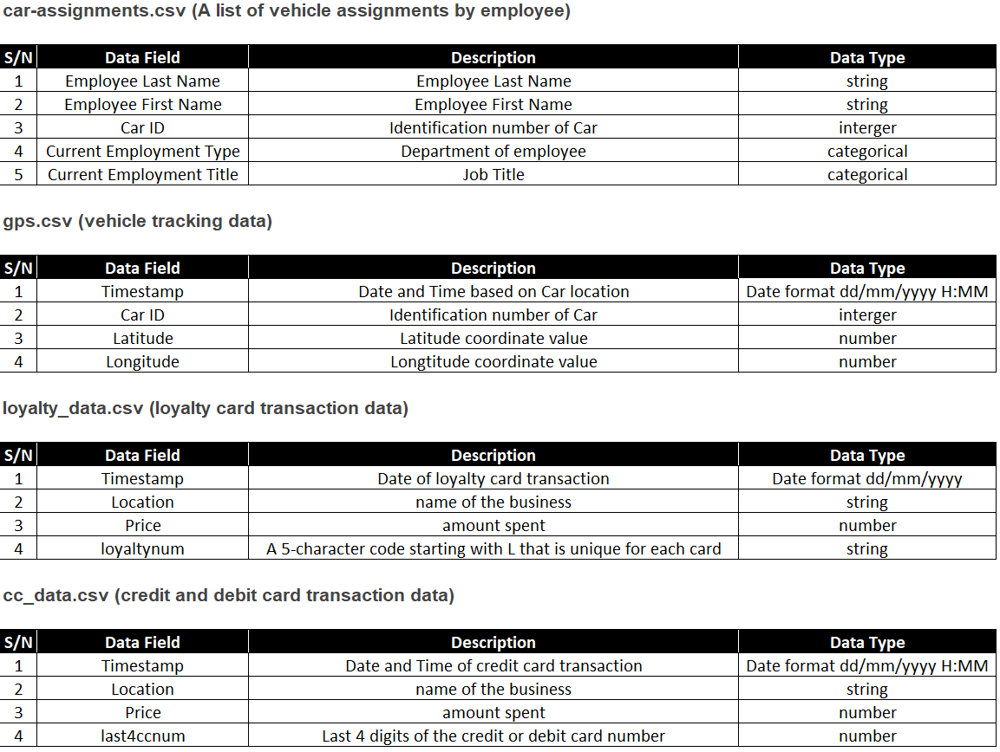
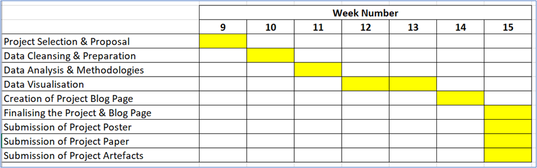

```{r setup, include=FALSE}
knitr::opts_chunk$set(echo = FALSE)
```

# Motivation

Our Team will be taking on Vast challenge 2021 Mini-Challenge 2 and in this study, we aim to use various visual analytics techniques to discover fraudulent usage of company cars for personal business. We will be using the availability of information such as locations visited by the employees and credit cards usage to discover suspicious activities.

# Project Objectives

The project aims to deliver an R-Shiny App that provides:
1.	Interactive user interface to allow users on selection of key parameters (such as Car ID, card number, vendor name) to discover visited locations and card spending patterns.
2.	Visual map representation of the vehicle movement and popular locations
3.	Relationship discovery among GASTech personnel
4.	Indicators of suspicious activities via key findings

# Data Description
Data is from VAST Challenge 2021 and can be downloaded from VAST Challenge 2021: Mini-Challenge 2.

The Data packages provided includes the following

*  ESRI shapefiles of Abila and Kronos
*  A tourist map of Abila with locations of interest identified, in JPEG format (MC2-Tourist.jpg)
*  car-assignments.csv, gps.csv, loyalty_data.csv, cc_data.csv. 

The breakdown of the data type for the csv files are as follow.



# Proposed Scope and Methodology

1.	Data Preparation In R
2.	Conducting Exploratory Data Analysis in R
3.	Visualising and Analysing Time-Oriented Data
4.	Visualising Geographical Data and conducting Geospatial Analysis in R
5.	Using R Shiny to build web-enabled application

# Storyboard & Visualization Features

# Project Timeline & Deliverables 
Key deliverables as part of our project would include the below:

*  Project Website
*  Project Github
*  R Shiny web application
*  Research paper
*  Poster
*  Project artifacts



# Software Tools
* [RStudio](https://rstudio.com/)

# R Packages
*  [shiny](https://shiny.rstudio.com)
*  [tidyverse](https://www.tidyverse.org)
*  [tmap](https://cran.r-project.org/web/packages/tmap)
*  [DT](https://cran.r-project.org/web/packages/DT)
*  [plotly](https://cran.r-project.org/web/packages/plotly)
*  [ggplot2](https://cran.r-project.org/web/packages/ggplot2/index.html)

# Team Members

1. Amrita Mishra
2. Sng Kah Leong

# References

* [Modern R with the tidyverse](https://b-rodrigues.github.io/modern_R/) by Bruno Rodrigues
* Brendan R. E. Ansell [Introduction to R - tidyverse](https://bookdown.org/ansellbr/WEHI_tidyR_course_book/)
* Aravind Hebbali (2020) [Data Visualization with ggplot2](https://viz-ggplot2.rsquaredacademy.com/index.html)
* Rob Kabacoff (2020) [Data Visualization with R](https://rkabacoff.github.io/datavis/)
* Hadley Wickham (2020) [Mastering Shiny](https://mastering-shiny.org/). 
* David Granjon (2020) [Outstanding User Interfaces with Shiny](https://unleash-shiny.rinterface.com/index.html)
* Garrett Grolemund & Hadley Wickham (2020) [R for Data Science](https://r4ds.had.co.nz/).


